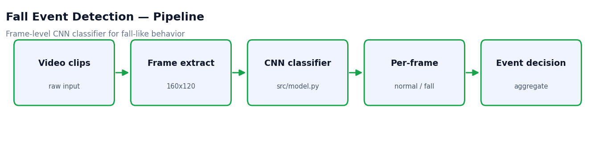
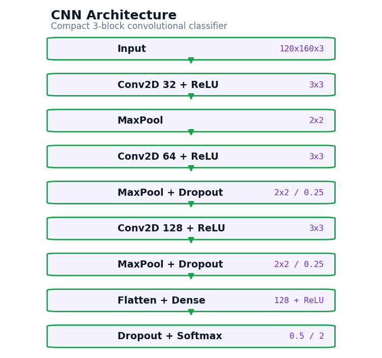

# Fall Event Detection (CNN)


A video-event classification project for **detecting fall-like behavior from frame data**. The repository separates the model definition from the original notebook so the project can grow into a reproducible training and evaluation pipeline.



## Features

- Compact CNN classifier defined in `src/model.py`.
- Model-summary command for quick architecture review.
- Documented expected local dataset layout.
- Keeps raw videos, extracted frames, and trained models out of Git.

## Architecture



## Project Structure

```text
fall-event-detection-cnn/
├── assets/             # pipeline + architecture diagrams
├── notebooks/          # original workflow record (executed, with outputs)
├── scripts/            # runnable utilities (model_summary.py)
└── src/                # maintained model code
```

## Installation

```powershell
python -m venv .venv
.\.venv\Scripts\activate
pip install -r requirements.txt
```

## Usage

```powershell
python scripts/model_summary.py
```

## Local Data

```text
data/
└── raw/
    ├── training/
    └── evaluation/
```

A common binary setup is `0 = normal`, `1 = fall`. Class labels should be documented with the dataset.

## Roadmap

- Move frame extraction and preprocessing into `src/data.py`.
- Add train/evaluate scripts with reproducible CLI arguments.
- Export confusion matrices and classification reports.
- Compare the frame-level CNN with CNN+LSTM or 3D-CNN models.

## License

Released under the [MIT License](LICENSE).
